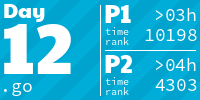
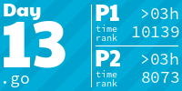
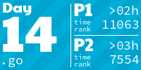
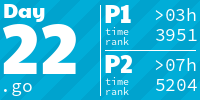
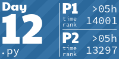
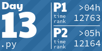

# Advent of Code

Solutions in python and golang, as I learn these languages. 2022 was my first year, but in 2023 I managed
all solutions and a semi sensible library to help me.

<!-- AOC TILES BEGIN -->
<h1 align="center">
  2023 - 50 ⭐
</h1>

<h1 align="center">
  2022 - 50 ⭐
</h1>

<h1 align="center">
  2021 - 8 ⭐
</h1>

<!-- AOC TILES END -->
